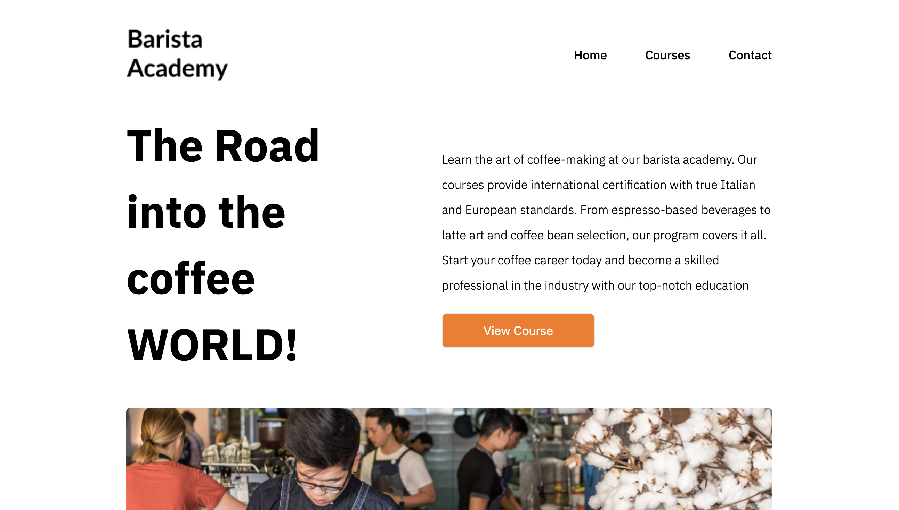

## Barista Academy Portfolio Project With React

This project is created to challenge the academy design, especially in the Coffee industry. The design was made to look aesthetic design and modern which challenge the Student to explore the website.

## Technologies Used

- React
- Tailwindcss
- Framer Motion

## Features

- Clean and modern design
- Responsive layout for mobile, tablet, and desktop screens
- Able to navigate to each page Send a contact back form for the user who is interested in the course

## Acknowledgments

- TailwindCss
- Framer Motion

## Final Design

